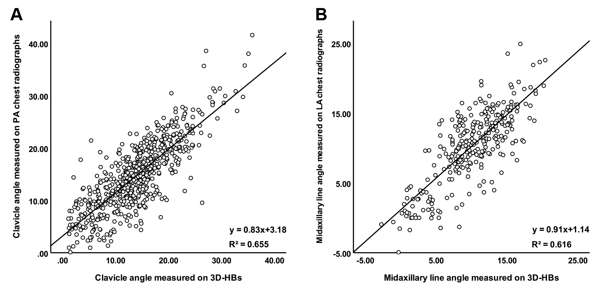
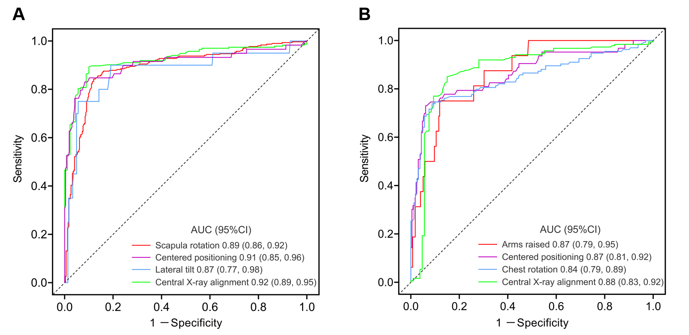
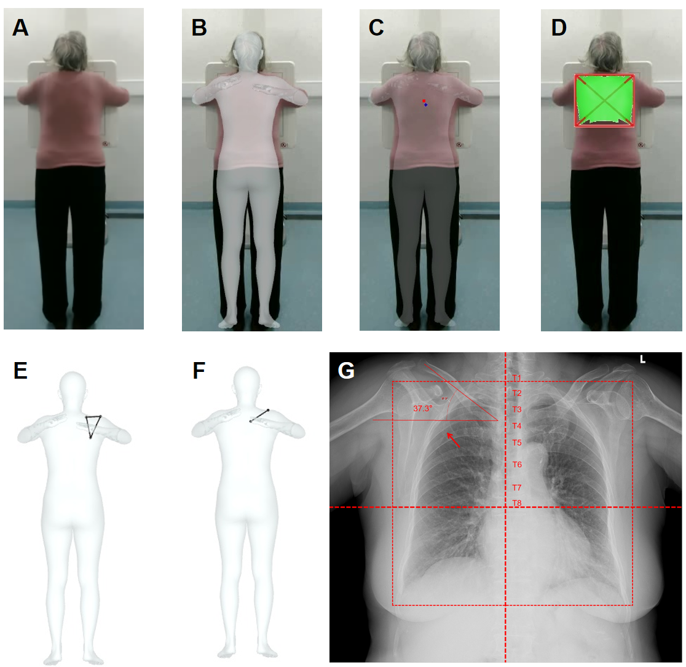
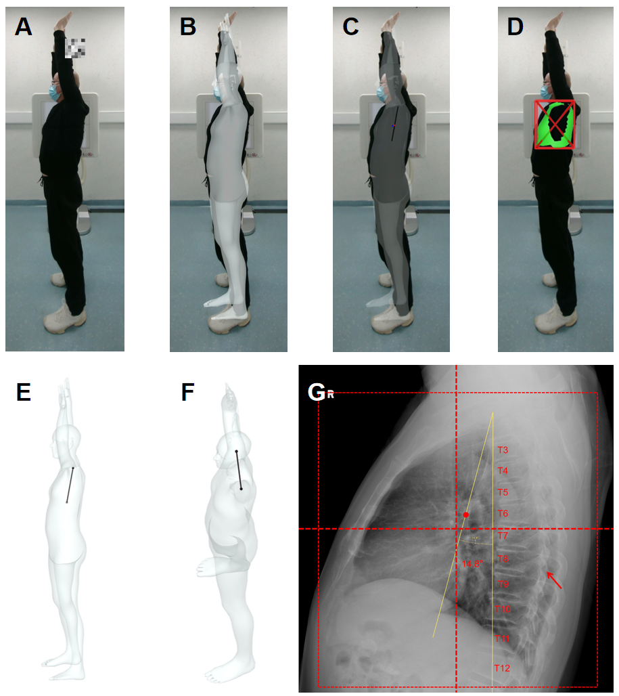

# ChestX_PCA

Chest X-ray positioning & collimation prospective QC before imaging.

Figure1: Algorithm workflow and study and study flowchart.

Figure2: Scatter diagram and linear regression analysis of angles measured on chest radiographs and 3D-HBs. (A) The scatter diagram with a fit line shows good linear relation between clavicle angles measured on two approaches, with a linear equation of y = 0.83x+3.18. The angles of two clavicles are included in the calculation, so there is more data. (B) The scatter diagram with a fit line also shows good linear relation between midaxillary line angles measured on two approaches, with a linear equation of y = 0.91x+1.14. PA = posteroanterior, LA = lateral, 3D-HB = 3D human body.

Figure3: Performance of the 3D-HB in assessing patient positioning. (A) Receiver operating characteristic curves show performance of the 3D-HB in assessing scapula rotation, centered positioning, lateral tilt and central X-ray alignment, which are 4 quality control metrics in posteroanterior chest radiography. (B) Receiver operating characteristic curves show performance of the 3D-HB in assessing arms raised, centered positioning, chest rotation and central X-ray alignment, which are 4 quality control metrics in lateral chest radiography. 3D-HB = 3D human body, AUC = area under the receiver operating characteristic curve.

Figure4: Example of a 74-year-old female undergoing posteroanterior chest radiography. (A) Image captured by the camera system. (B) Projection of reconstructed 3D human body (3D-HB). (C) Red dot: the projection of the sixth thoracic vertebra; blue dot: actual central X-ray. (D) The bounding box surrounds the minimal chest mesh (green), forming the smallest collimation area in the 3D-HB. (E) Right scapula keypoints are showed with a rotation angle of 13.4 degrees, which is below the cutoff value obtained in this study (14.5 degrees), indicating that the medial border of this scapula was not outside the lung field. (F) Right clavicle keypoints are showed with an angle of 35.1 degrees. (G) The chest radiograph shows a right clavicle angle of 37.3 degrees, close to the 3D-HB results. The dashed cross represents the mid-vertical and mid-horizontal lines. The dashed box is the smallest collimation area. The medial border of the right scapula was not outside the lung field (arrow), which is consistent with the findings in the 3D-HB.

Figure5: Example of a 53-year-old male undergoing lateral chest radiography. (A) Image captured by the camera system. (B) Projection of reconstructed 3D human body (3D-HB). (C) Red dot: the projection of the midaxillary line at the sixth thoracic vertebra level; blue dot: actual central X-ray. (D) The bounding box surrounds the minimal chest mesh (green), forming the smallest collimation area in the 3D-HB. (E) The midaxillary line in the 3D-HB is showed with an angle of 12.8 degrees. (F) The shoulder line for chest rotation is showed with a body yaw angle of 5.2 degrees, which was greater than the cutoff value obtained in this study (4.93 degrees), indicating that posterior edges of both lungs did not align well. (G) The chest radiograph shows a midaxillary line angle of 14.8 degrees, close to the 3D-HB results. The dashed cross is the mid-vertical and mid-horizontal lines. The dashed box is the smallest collimation area. The posterior edges of both lungs did not align well (arrow), which was consistent with the findings in the 3D-HB. The red dot is the ideal central X-ray. If the actual X-ray line moves upward, the costophrenic angle could be clipped, unless the midaxillary line angle is smaller.
